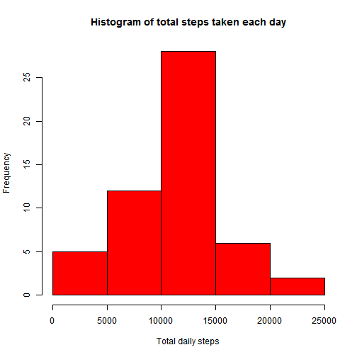
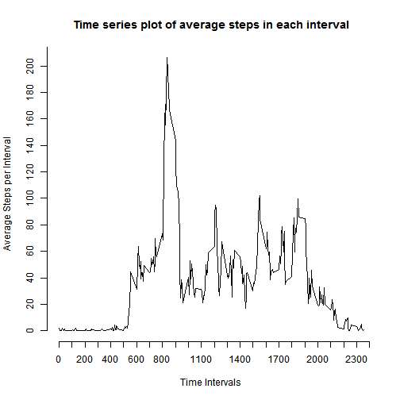
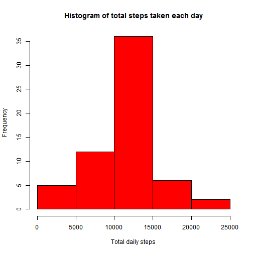

## Loading and preprocessing the data
  Read the data

```r
  Data <- read.csv("activity.csv")
  library(plyr)
```

```
## Warning: package 'plyr' was built under R version 3.1.1
```

```r
  library(ggplot2)
```

```
## Warning: package 'ggplot2' was built under R version 3.1.1
```


## What is mean total number of steps taken per day?
    For this section, we will ignore all missing values. In order to look at total number of steps taken, first we will create a histogram of total steps taken each day

```r
    dailySteps <- ddply(Data, .(date), summarise, sumSteps=sum(steps))
    hist(dailySteps$sumSteps,col="red", xlab ="Total daily steps", main = "Histogram of total steps taken each day" )
```

 

```r
  meanSteps <-  as.integer(mean(dailySteps$sumSteps, na.rm=TRUE))
  medianSteps <- as.integer(median(dailySteps$sumSteps, na.rm=TRUE))
```
 Next, we will take a look at the mean and median values. The mean of total steps taken each day is 10766 and median of total steps taken each day is 10765
 
## What is the average daily activity pattern?
A time series plot  of the 5-minute interval (x-axis) and the average number of steps taken, averaged across all days (y-axis)


```r
      avgSteps <- ddply(Data, .(interval), summarise, meanSteps=as.numeric(mean(steps, na.rm=TRUE)))
      with(avgSteps, {
        plot(avgSteps$interval, avgSteps$meanSteps, type="l", pch=-1, xlab = "Time Intervals", ylab= "Average Steps per Interval", main = "Time series plot of average steps in each interval", axes=FALSE ) 
axis(side=1, at=seq(0, 2400, by=100))
axis(side=2, at=seq(0, 240, by=20))
})
```

 

```r
   maxStep = max(avgSteps$meanSteps)
   maxInterval = avgSteps[avgSteps$meanSteps==maxStep, ]$interval
```
On average, the interval that contains the most number of steps is 835. 

## Imputing missing values

```r
   missingData <- Data[is.na(Data$steps), ]
   updatedData <- Data[!is.na(Data$steps), ]
   totalMissing <- nrow(missingData)
```
  The total number of rows with missing data is `r totalMissing'. 
  
  Let us replace all missing values by the average number of steps taken during the same five minute interval. We will use the average steps per interval previously calculated for this purpose as below. We will then create a new data set which is the same as the old dataset but with missing values filled in. 
  

```r
   index <- match(missingData$interval, avgSteps$interval) 
   missingData$steps <- avgSteps[index, ]$meanSteps
   updatedData <- rbind(updatedData, missingData)
```

For the newly computed dataset, the histogram of total steps is as shown below.

```r
   dailyStepsNew <- ddply(updatedData, .(date), summarise, sumSteps=sum(steps))
    hist(dailyStepsNew$sumSteps,col="red", xlab ="Total daily steps", main = "Histogram of total steps taken each day" )
```

 

Next, for this new dataset, we will take a look at the mean and median values.

```r
  meanSteps <-  as.integer(mean(dailyStepsNew$sumSteps, na.rm=TRUE))
  medianSteps <- as.integer(median(dailyStepsNew$sumSteps, na.rm=TRUE))    
```
The mean of total steps taken each day is 10766 and median of total steps taken each day is 10766. We can thus see the mean is unchanged but median is now changed and matches the mean. 

## Are there differences in activity patterns between weekdays and weekends?
